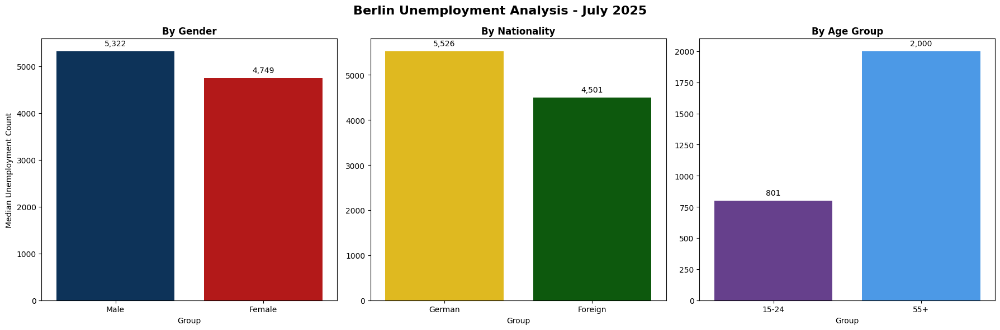

# Berlin Unemployment Analysis - July 2025

## 🔍 Personal Context
As a Berlin resident who became unemployed in July 2025, I created this analysis to:
- Understand Berlin's job market challenges
- Identify which demographic groups are most affected
- Discover potential opportunities for reemployment

---

## 📊 Official Dataset
### Primary Data Source
[Federal Employment Agency Berlin-Brandenburg](https://www.arbeitsagentur.de/vor-ort/rd-bb/statistik)  

| Attribute          | Value                     |
|--------------------|---------------------------|
| Reference Month    | July 2025                |
| Publication Date   | July 29, 2025            |
| Coverage           | 12 Berlin Job Centers    |

---- 

### Data Structure
📂 BA_Stats_2025-07.xlsx
 ├── Metadata (3 tabs)

 ├── Core Data:
  
  │   ├── Gender (Männer/Frauen)
  
  │   ├── Nationality (Deutsche/Ausländer)
  
  │   ├── Age Groups (15-24, 55+)
  
  │   └── Special Categories
  
  └── Methodology (3 tabs)

---- 

# Berlin Unemployment Analysis - July 2025

This project analyzes July 2025 unemployment statistics in Berlin by **age group**, **nationality**, and **gender**, using official data from the Federal Employment Agency.

---

## 📊 Key Visualizations

# Berlin Unemployment Analysis - July 2025

This project analyzes July 2025 unemployment statistics in Berlin by **age group**, **nationality**, and **gender**, using official data from the Federal Employment Agency.

### **1. Unemployment by Age Group**

### **2. Unemployment by Nationality**

### **3. Unemployment by Gender**

---

## 🔍 Key Findings
- **Largest unemployed group by nationality**: German nationals (**5,526**) — suggesting structural unemployment rather than purely migrant-related factors.
- **Lowest unemployment rate**: Youth 15–24 (**801**) — possibly due to active participation in apprenticeships, vocational programs, or education.
- **Gender gap**: Male unemployment is **1.1× higher** than female — may reflect sectoral employment patterns, with men more concentrated in industries facing slowdowns.
- **Aging workforce impact**: Higher unemployment in the 55+ group indicates possible age-related labor market exclusion.

---

## 📂 Project Structure

├── arbeitslos_Berlin_by_age.png

├── arbeitslos_Berlin_by_nationality.png

├── arbeitslos_Berlin_by_gender.png

├── analysis.py

└── README.md

---

## ✍️ Author
Amira Ben Salem  
📧 besamiraatgmail.com
